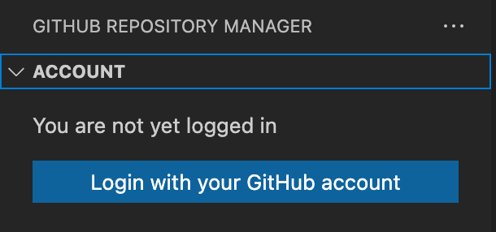

## 启动项目

```bash
# 开启监听
npm run watch

# 然后打开调试框
```

## 配置活动栏

在配置了`viewsContainers.activitybar`之后，直接去调试是不会显示活动栏的，必须再配置`views`之后才会显示，结果如下：


## 配置viewsWelcome

```json
"viewsWelcome": [
    {
        "view": "github.account",
        "contents": "You are not yet logged in\n[Login with your GitHub account](command:githubRepoMgr.commands.auth.vscodeAuth)"
    }
]
```

结果如下：



## 登录


